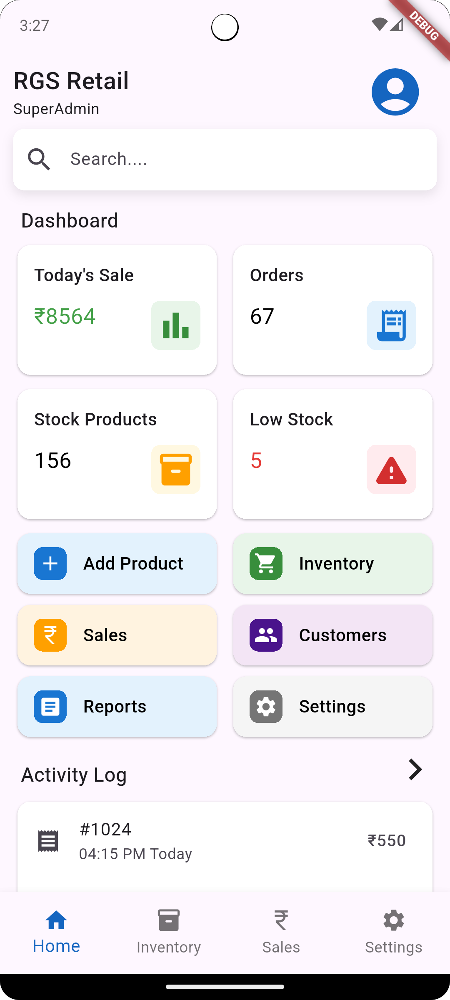
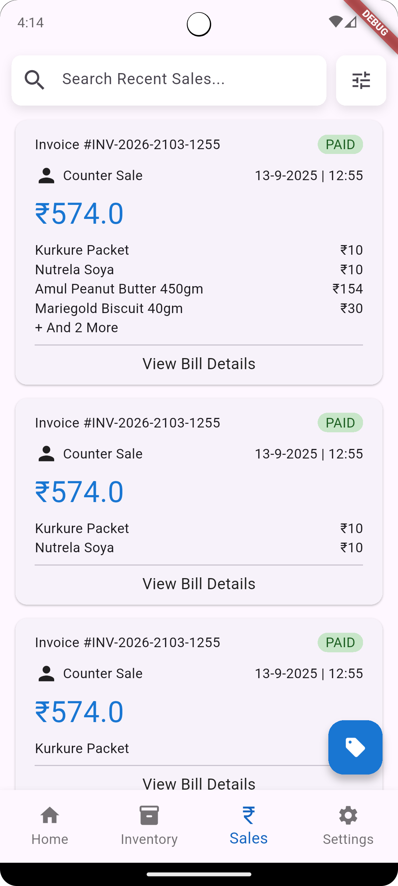

# Store Manager App

A Flutter-based inventory management application designed for small businesses and retail stores.
The app helps manage products, stock, and sales in a simple and efficient way.

## 🚀 Features

* Product inventory management
* Sales tracking
* Simple dashboard interface
* Batch-based stock handling
* Clean and minimal UI

## 🛠 Built With

* Flutter
* Dart
* Material UI

## 📂 Project Structure

storeManager/
├ android/
├ lib/
│  ├ main.dart
│  ├ home_screen.dart
│  └ sales_screen.dart
├ test/
├ pubspec.yaml
├ pubspec.lock
└ README.md

## ⚙️ Installation

Clone the repository

git clone https://github.com/dev-yashraj52/store-management-app.git

Go into the project directory

cd store-management-app

Install dependencies

flutter pub get

Run the app

flutter run

## 📌 Future Improvements

* User roles (Admin / Staff / Super Admin)
* Barcode scanning
* Expiry tracking
* Sales analytics
* Cloud database integration

## 👨‍💻 Author

Yashraj
GitHub: https://github.com/dev-yashraj52

## 📱 App Screenshots

  
  

